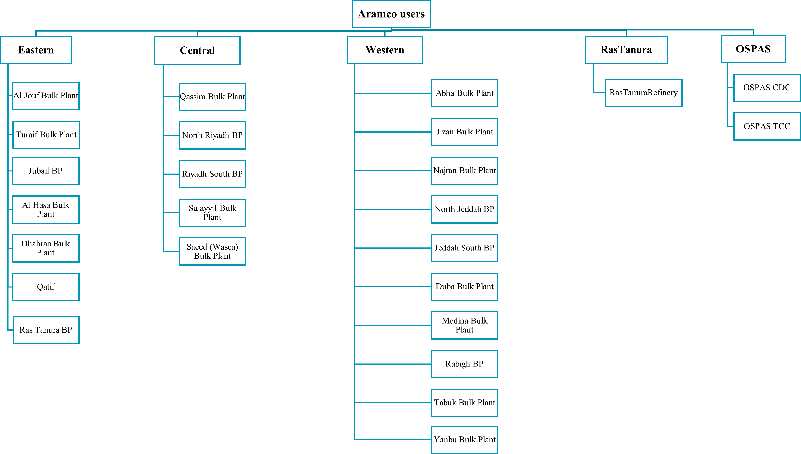
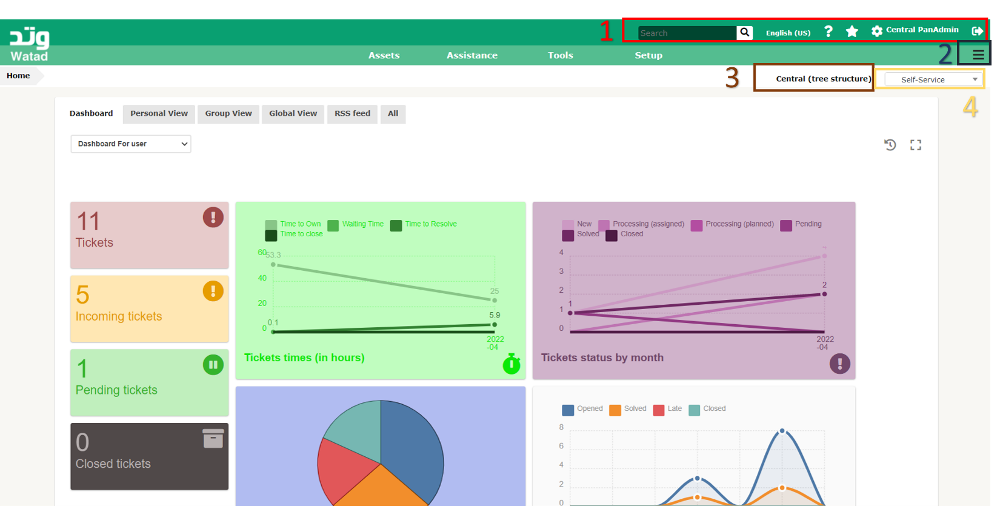
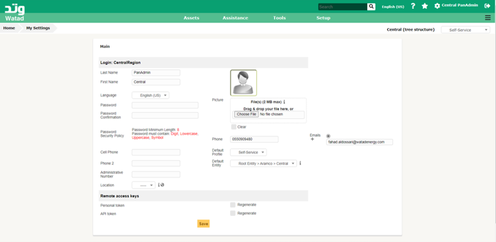
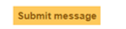
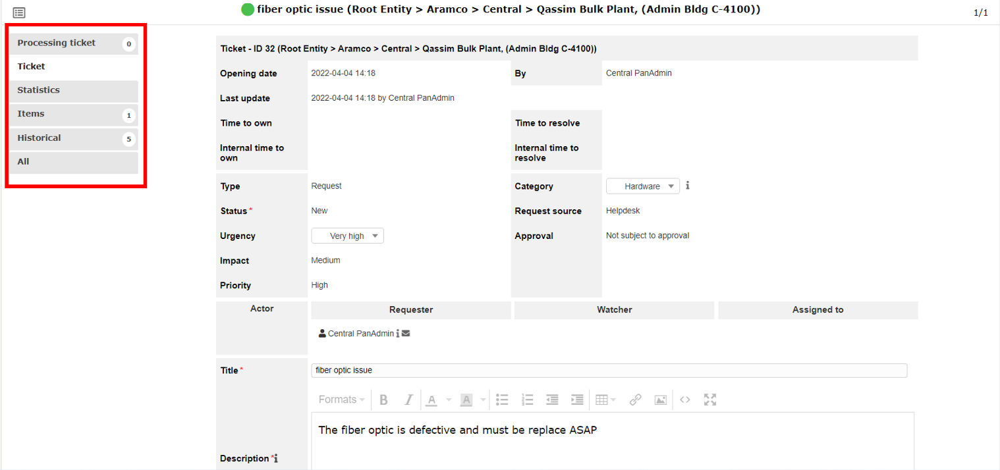
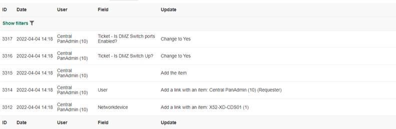

<table>
<colgroup>
<col style="width: 100%" />
</colgroup>
<tbody>
<tr class="even">
<td><h1 id="it-system-managment">IT System managment</h1> Crated by Watad Energy &amp;
Communications</td>
</tr>
<tr class="odd">
<td></td>
</tr>
</tbody>
</table>

# Table of Contents

[IT System managment 1](#_Toc100369342)

[**Version** 2](#_Toc100369343)

[**Goals &amp; Objective** 4](#_Toc100369344)

[**Introduction** 4](#_Toc100369345)

[**User Classification** 5](#_Toc100369346)

[**Start with Watad ITSM** 6](#_Toc100369347)

[**Exploring The Watad Itsm Pages** 7](#_Toc100369348)

[**Area-1** 7](#_Toc100369349)

[**Area- 2** 9](#_Toc100369350)

[**Area-3** 9](#_Toc100369351)

[**Area-4** 10](#_Toc100369352)

[**Self – Service profile** 10](#_Toc100369353)

[**Area-1** 11](#_Toc100369354)

[**Display devices for specific plant** 12](#_Toc100369355)

[**Display device information** 12](#_Toc100369356)

[**Area-2** 13](#_Toc100369357)

[Area-3 15](#_Toc100369358)

[**Ticket profile** 17](#_Toc100369359)

[Area- 1 Home 18](#_Toc100369360)

[Area- 2 Create a ticket 18](#_Toc100369361)

[**Submit a request from Watad ITSM system** 19](#_Toc100369362)

[Area- 3 Tickets 21](#_Toc100369363)

[**Ticket content** 22](#_Toc100369364)

# **Version **

<table>
<colgroup>
<col style="width: 12%" />
<col style="width: 16%" />
<col style="width: 44%" />
<col style="width: 27%" />
</colgroup>
<thead>
<tr class="header">
<th>
Version 
</th>
<th>
Date 
</th>
<th>
Description 
</th>
<th>
Author / Reviewer 
</th>
</tr>
</thead>
<tbody>
<tr class="odd">
<td>
1.0 
</td>
<td>
<strong>5</strong> <strong>April</strong> 2022 
</td>
<td>
<strong>ITSM manual</strong>
</td>
<td>
<strong>Maha Alhobishi</strong> 
</td>
</tr>
<tr class="odd">
<td>
2.0 
</td>
<td>
<strong>10</strong> <strong>May</strong> 2022 
</td>
<td>
<strong>ITSM manual</strong>
</td>
<td>
<strong>Maha Alhobishi</strong> 
</td>
</tr>
</tbody>
</table>

# **Goals & Objective**

The **purpose** of this Manual is to provide an overview of the Watad
ITSM system and ensure that users get the most out of all the services
provided.

The **objectives** of this Manual are to: 

-   Provide clear reference to get all the essential information.

-   Present a clear, concise, and measurable description of service provision to the customer.

-   Match perceptions of expected service provision with actual service support & delivery. 

## **System Overview**

Watad ITSM is an IT service management system that helps our customers manage all their network assets. Watad ITSM's mission is to provide high-quality customer support and ensure the provisioning of services required to support and maintain customer satisfaction. Using the Watad ITSM site, the ITSM system will facilitate communication between consumers and service providers, including feature requests and incident requests. The portal will be available 24 /7 to receive client requests, which will be processed promptly in the system and allocated to one engineer who will take appropriate action. This document will walk you through the steps of using Watad ITSM.

# 
HOW TO REQUEST A TICKET?

User can request ticket to express the need by three different ways as mentioned bellow:    

1-	User can submit a request from “ www.support.watadenergy.com” see (Submit a request from Watad ITSM system) .
  
2-	User can send an email to “help@support.watadenergy.com” and the ticket will be created immediately.
  
3-	User can contact an operator directly (or by telephone: +966 0138836006).

# **User Classification** 

To gain access to the Watad ITSM system, you will need a username and
password. Each account is given its own set of privileges and services.
In Watad ITSM, a user account is defined by a region name, such as
CentrelRegion. Under the region all plants associated with it as entity.
The diagram below depicts each region and their plants.

# **Start with Watad ITSM**

This section describes how to access the Watad ITSM system and all the
portal pages. This system requires the use of a web browser where the
optimum operation of the application is achieved by using a modern
browser and being compliant with web standards. The following browsers
are preferred: Firefox version 3 and higher, Seamonkey version 2 higher,
Opera, Safari, or Chrome. Watad ITSM also works on Internet Explorer
version 7 and above. The compatibility with Internet Explorer 6 or lower
is not assured.

Start the browser and go to Watad ITSM Log in page 
[www.support.watadenergy.com](http://www.support.watadenergy.com).
Access to the application features requires authentication where the
user has to write his/her username and password as provided by Watad
team Figure (1).

# **Exploring The Watad ITSM Pages**

The user has two major profiles: "self-service" and "Ticket," each of
which tries to deliver various services while maintaining the same
logic.

Watad
ITSM’s page consists of four areas which are shared by the two profiles
("self-service" and "Ticket"), refer to the below Figure (2).

## **Area-1**  

-   Search box: user can search in the system from this box 

-   Language: user can change the language of the system where is 115
    languages available

-   Help: help will transfer the user to <https://owlcyberdefense.com/product/xd-guardian/>

-   Star: contain all the previous searches that the user search on

-   Setting: user can add/update its information and password as shown
    in Figure (3)

	> 
	> Figure (3)

-   Surname: surname of the user

-   First name: First name of the user

-   Language: user can change the language of the system from here.

-   Password: every user must follow the criteria which is minimum
    length is 8 and it must contain: Digit, Lowercase, Uppercase, Symbol

-   Password confirmation: repeat the password here to verify

-   Phone: user default phone number

-   Mobile Phone: user mobile number

-   Phone 2: user alternative mobile number

-   Administrative number: user administrative number

-   Location: drop-down menu with all plant name, user must choose the
    main location of the user

-   Picture: user can add picture for its profile

    -   Clear: remove the picture
    
    	

-   Email: user can add more than one email by click on “plus button”

    -   Default Email: when user add more than one email, he/she can specify which email has to be default by click on the email 
	    
	    

-   Default profile: user can choose which profile shown after log in
    page

-   Default entity: user can choose the default plant profile shown
    after log in page

-   Remote access keys (This is needed for integrating with other
    applications, <u>not needed for your tasks</u>)

    -   Personal token

    -   API token

## **Area- 2** 

When the user clicks this button, a pop-up page will be displayed, as
illustrated in Figure (4), with all of the profile's tabs depending on
the profile type.

## **Area-3** 

This area shows in which
region and plant the user has access to it. Where the user can choose
specific plant to display it’s assets and request ticket by “click on
click on “ all the plants name under this region will be display Figure
(5), then user can select specific plant.

###  **Area-4** 

From the drop-down menu, the user can alter his or her profile
depending on the functionality that must be performed.

# **Self – Service profile** 

## Overview

When a user logs into the account, "Self-Service" profile with four
areas will appear by default Figure(6). Where the default profile can
be change see ([Area-1 Setting](#area-1)).

### **Area-1** 

Users can display all the
assets under the region by clicking on the “asset network device” Figure
(7). Asset’s page has seven areas that will be described below:

1.  All devices classified under the selected region or plant.

2.  The user can choose to show a specified number of devices in area 1.

3.  Users can download the device list in different formats such as pdf,
    CSV and more by “click on the drop-down menu choose the correct
    format press on download button”.

4.  Search icon will show “area 5”.

5.  Search engines
    
    assist in the discovery of certain devices or fields, as well as the
    use of advanced searching by selecting "rule," which displays the
    logic operator, or "group," that also displays other search engines.
    A list of devices is shown after the criteria and validated research
    have been determined.

6.  More devices can be added by pressing the button
    
    .<u>"It is not available to the regular users”.</u>

7.  "Action" will assist in the transfer of device from one plant to
    another. "Select the devices press action a pop-up interface will
    appear drop-down menu select "transfer" \> drop-down menu to choose
    the new plant's name".

### **Display devices for specific plant** 

To display devices under
specific plant: “press the region name in the up-lift hand side press +
to show all the plants name under this region press plant name “Figure
(8).

### **Display device information**

To display the device information: “Assets Networkdevice Press on device
name” Figure (9). User can only view the device information and view
when it’s created and the last update Figure (10).

### **Area-2**  
	This area will provide a list of tickets for where the user was the requester, together with the ticket's details, see (Ticket) to get more information.

### **Area-3** 

There are two tools available for the user which is “personal reminder”
and “personal RSS feed” Figure (11).

#### **Personal reminders**

Users can view all previously set reminders, search for any reminder
using the search engine Figure (12) and add a new reminder by" press +
button enter all the details ADD" Figure (13).

#### **Personal RSS feed**

Really Simple Syndication (RSS) is a simple, standardized content
distribution system that allows users to stay up to date with their
favorite websites. Rather than visiting websites to look for new posts
or subscribing to websites to be notified of new posts. User can view
all the defined reminders as well as search about specific reminder
Figure (14). To add new RSS feed “press + button fill the details ADD”
Figure (15).

Area-3

Watad ITSM offers a feature that allows you to receive notifications.
This enables the user to get notifications in response to pre-defined
activities. The user can view all of the admin-defined notifications
(16). Users can add new notifications; however, we prefer to ask the
administrator to define new notifications and delete them for security
reasons.

Pre-defined notification:

1.  Create a ticket: when user create a new ticket, the system will send
    an email to the user and admin.

2.  Follow-up: when any update happens to the ticket, the user will
    receive an email.

Area- 4 Dashboard

A customizable dashboard Figure (17), provides advanced statistical
analysis of various data collected by the system, including:

1.  Tickets

2.  Incoming tickets

3.  Pending tickets

4.  Closed tickets

5.  Ticket time (In hour)

6.  Tickets status by month

7.  Top ticket's entities

8.  Evolution of ticket in the past year

As well as provides an overview for quick access to active elements
where it’s divided into three views:

-   personal view: display the user's schedule and available notes

-   Group view: provides information about the tickets with relation to
    the reference groups to which the user belongs. <u>“Still not
    activated for regular user.”</u>

-   Global View: displays statistics on the tickets depending on their
    status according to their expiration date. <u>“Still not activated
    for regular user.”</u>

-   RSS Feeds offers defined RSS feeds content.

## **Ticket profile**

Users can change the profile type from the top right-hand side drop-down
menu and then change it to the “Ticket” profile. This profile contains
three areas where the user can deal with the ticket Figure (18).

### Area- 1 Home

The home page provides simple dashboard Figure (19) of various data
collected by the system, including:

Area-
2 Create a ticket

To begin, the user must express a need. For that there are several tools
to choose from:

1.  User can submit a request from “
    [<u>www.support.watadenergy.com</u>](http://www.support.watadenergy.com)”
    see ([Submit a request from Watad ITSM
    system).](#submit-a-request-from-watad-itsm-system)

2.  User can send an email to “<u>help@support.watadenergy.com</u>” and
    the ticket will be created immediately.

3.  User can contact an operator directly (or by telephone: +966
    0138836006).

###  **Submit a request from Watad ITSM system**

User has to be in the plant
level to open new ticket for specific device, to be in plant level see
([Change the plant level](#area-3)). To open new ticket from “Create a
ticket” tab or from home page as shown in Figure(20) the user must fill
the mandatory fields to open a new ticket where the field described
below:

-   Type: A drop-down menu with two options:

    -   Incidents: If an
        issue arises.

    -   Request: If there are any additional requirements that must be
        implemented.

-   Category: Allows you to
    filter requests and incidents according to their use of. Three
    options in a drop-down menu:

    -   Hardware: If an issue arises or new hardware is required.

    -   Software: If a problem arises or new software is required.

-   Urgency: The requester's
    rating of the ticket's importance. A drop-down menu with five
    options for determining the amount of urgency, including "very
    high," "High," "Medium," "Low," and "Very low."

-   Inform me about the actions taken:

    -   Follow-up: Facilitates contact between the requester and those
        in charge of his ticket; any changes on this ticket will be
        forwarded to the requester through email.

        -   Email Follow-up:
            To enable or disable this feature.

        -   Email: Pre-filled with user’s email if defined in user
            setting. If no email is defined in user or supplier form, an
            email can be entered in text field.

-   Associated elements:

-   General: If the request or occurrence is unrelated to any device,
    the user should select general. After selecting it, press "Add".

-   Networkdevice: If there is a request or an incident involving
    devices in the plant, the user has to select network devices. After
    selecting it, a drop-down menu with all plant related devices will
    appear. The user must select one device then press "Add".

<!-- -->

-   Title: Mandatory field where the user should write concise and
    informative words.

-   Description: Mandatory field where the user has to describe the
    incident happen or the new requirements.

-   File attachment: User can attach any type of files.

-   Questions: Mandatory yes/no questions include:

    -   Is XD-Guardian turned on LED ON?

    -   Is DMZ Switch Up?

    -   Is DMZ Switch ports Enabled?

    -   Is it related to TNS?

    -   Is it related to PI?

    -   Is it related to Archsight?

> 

After filling out all of the
fields, the user must submit a message to submit the ticket to the
person in charge of this region.

Area-
3 Tickets

This area will provide a list of tickets for where the user was the
requester, together with the ticket's details, which will be described
below:

-   ID: Ticket has a unique number that allows the user to track the
    ticket with the Watad engineers.

-   Title: Name of the ticket

-   Entity: Describe the related region and/or plant for which the
    ticket was issued

-   Status: Define the ticket life cycle with the following status:

    -   New: Upon its creation

    -   Processing (assigned): When an engineer assigned to be
        responsible it

    -   Processing (planned): If a new task added to it

    -   Pending: When the ticket is hold

    -   Solved: When a solution is added to the ticket

    -   Closed: when the solution has been validated and fully
        implemented

-   Last update: Date at which the last status modification is done

-   Opening date: Ticket creation date.

-   Priority:  Importance of the ticket automatically computed from
    defined impact and urgency

-   Requester- Requester: References to the user who opened the ticket.

-   Assigned to- Technician: Refer to the person who is responsible
    about this ticket. <u>Not available for regular user</u>

-   Category: Refer to which type of incident or request

-   Time to resolve: Date at which ticket must be solved.

### **Ticket content** 

To review the ticket content, "From Ticket Press on ticket name." This
will bring up all of the ticket's content, with six tabs on the
left-hand side to handle it Figure(23).

-   Processing ticket:

> 
>
>  style="width:0.93403in;height:0.2375in" /> The Processing Ticket tab
> Figure(24) shows correspondence between the requester and the ticket's
> owner. Where the user can add follow-up from
>  style="width:0.90417in;height:0.2375in" />and upload additional
> documents from  style="width:0.81458in;height:0.20694in" />

 The "Timeline filter" on the
right-hand side provides rapid access to the Follow-up, Task, Documents,
Validation, Solution, and Rest display options.

-   Ticket

>  style="width:0.89861in;height:0.23194in" /> style="width:0.38681in;height:0.20833in" />This tab will display the
> whole content of the ticket. After updating or correcting the
> information, the user must click on . Also, user can delete the ticket
> by click on

-   Statistics

> It shows the timeline of the ticket.
>
> 

-   Items

	Display, add and delete several items to the ticket.
	
	
	
	
	To add a new device “Press on the drop-down menu Networkdevice Press on the drop-down menu Press on the device name Add”
	
	To delete a device “Select device name Action Press on drop-down menu
	“Delete permanently the relation with selected elements”
	
	

-   Historical

	
	- Display the history of the ticket.

-   All

 - Where all the tabs content is displayed under this tab. So, the user can go through all the contents.

## **Logout of Watad ITSM**

To disconnect, click on the “Logout” located in the upper right of the
screen Figure (25). Once the session is finished, the user is redirected
to the authentication page.

# **Conclusion**
 
 Watad ITSM is an IT service management system that assists our customers in managing their whole network devices. Watad ITSM's purpose is to provide outstanding customer service and to ensure that the services required to support and maintain customer satisfaction are provided. In this manual all the functionality and services of Watad ITSM described. 